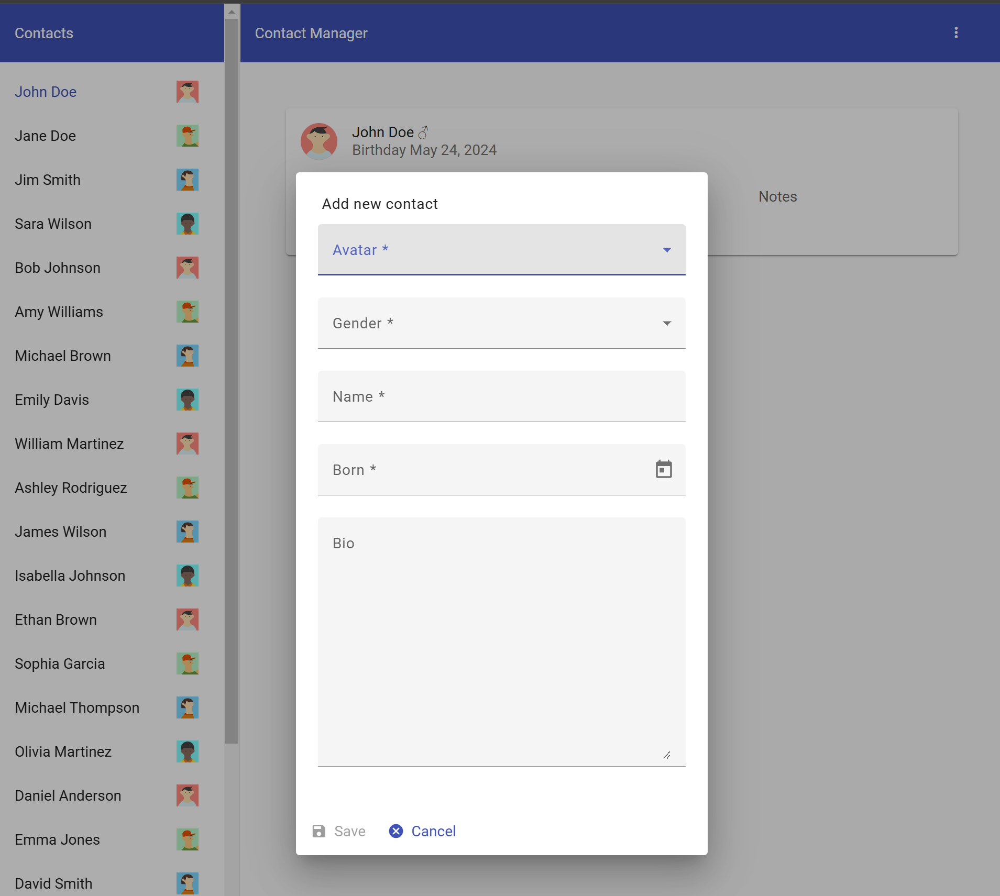

# Angular NPM Tinkering Project

This test project is a heavily-modified version of the code from the Pluralsight course [Styling Applications with Angular Material](https://www.pluralsight.com/courses/angular-material). My goal is to have a reasonably complex Angular codebase which integrates a set of NPM packages that I consider to be essential for modern web applications

## Running the Application

```shell
yarn install
yarn start
```

## Packages

- [Angular](https://angular.dev/)
- [Angular Material](https://material.angular.io/)
- [ESLint](https://eslint.org/)
- [Lodash](https://lodash.com/)
- [messageformat](https://messageformat.github.io/messageformat/)
- [Prettier](https://prettier.io/)
- [Tailwind CSS](https://tailwindcss.com/)
- [Transloco](https://jsverse.github.io/transloco/)
- [Yarn](https://yarnpkg.com/)

## Screenshot



## Known Issues

- Node 20 LTS is the maximum supported version since later versions have a bug that break tailwindcss configs that use Typescript.
